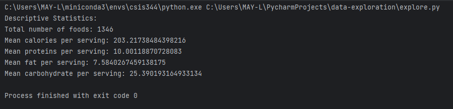
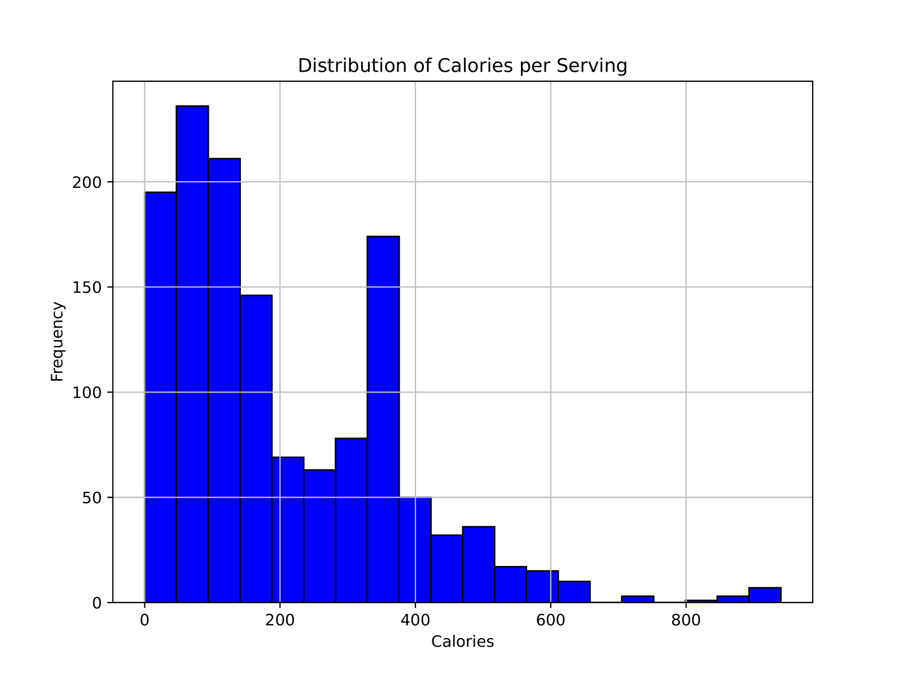
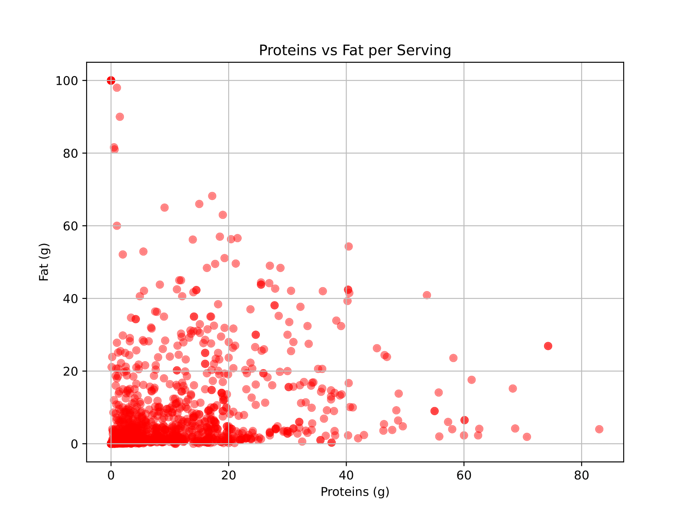
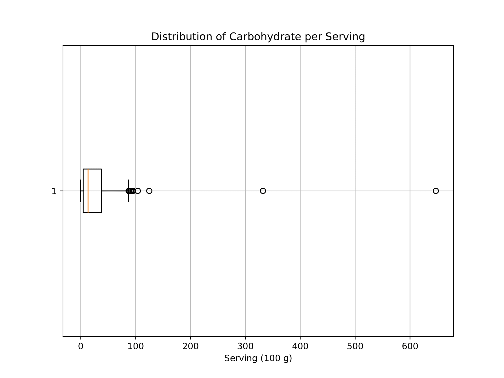

# Data Exploration

## Topic

Indonesian Food and Drink Nutrition Dataset

## Data Source(s)

https://www.kaggle.com/datasets/anasfikrihanif/indonesian-food-and-drink-nutrition-dataset

"This dataset was obtained from the Tabel Komposisi Pangan Indonesia (Indonesian Food Composition Table) 
data published by the Ministry of Health of the Republic of Indonesia (www.panganku.org). 
This dataset has gone through a modification process in the form of data cleaning and adding image links."

## Brief Description

Nutrition information about various Indonesian food & drinks. It includes data on calories, proteins, 
fats, and carbohydrates of each type of food/drink.

## Results

